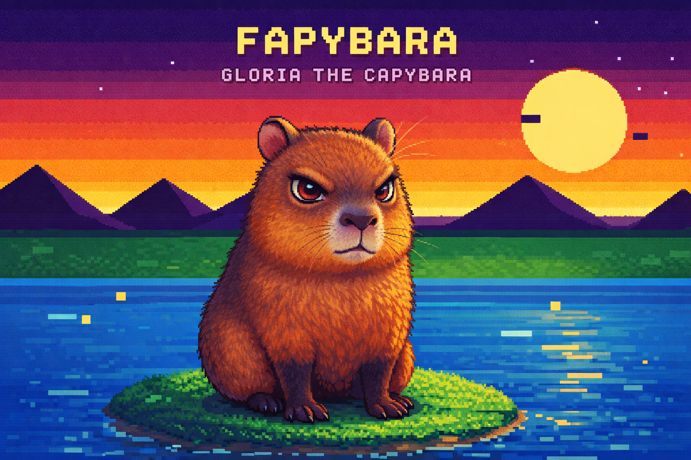

<p align="center">
  
</p>

# English

# Gloria Run: Fapybara Edition

A classic "endless runner" game inspired by Atari aesthetics, starring our mascot, the capybara **Glória**!

Developed with [LÖVE (Love2D)](https://love2d.org/) for the Fapybara ecosystem.

## How to Play
Glória needs to run through different biomes, dodging obstacles and collecting fireflies to increase her score.

*   **Controls:**
*   **Right/Left Arrows:** Control Glória's speed. 
*   **Up Arrow / Space:** Jump. 
*   **Down Arrow:** Duck (to avoid high obstacles).
*   **Mobile:** The game features on-screen touch controls.
*   **Levels:** The scenery changes based on the distance traveled: Sunset, Desert, Night, and Jungle.

## Requirements
*   [LÖVE 11.4](https://love2d.org/)

## Running the Game
To run it on your computer (desktop), simply have LÖVE installed and point it to the game folder.

```bash
love .
```

# Portuguese
# Gloria Run: Fapybara Edition

Um jogo estilo "endless runner" clássico, inspirado na estética do Atari, estrelando a nossa mascote, a capivara **Glória**!

Desenvolvido com [LÖVE (Love2D)](https://love2d.org/) para o ecossistema Fapybara.

## Como Jogar
A Glória precisa correr através de diferentes biomas, desviando de obstáculos e coletando vagalumes para aumentar sua pontuação.

*   **Controles:**
    *   **Setas Direita/Esquerda:** Controlam a velocidade da Glória.
    *   **Seta Cima / Espaço:** Pula.
    *   **Seta Baixo:** Abaixa (para desviar de obstáculos altos).
*   **Mobile:** O jogo possui botões na tela para toque.
*   **Fases:** O cenário muda conforme a distância percorrida: Pôr do Sol, Deserto, Noite e Selva.

## Requisitos
*   [LÖVE 11.4](https://love2d.org/)

## Execução
Para rodar no seu computador (desktop), basta ter o LÖVE instalado e apontar para a pasta do jogo.

```bash
love .
